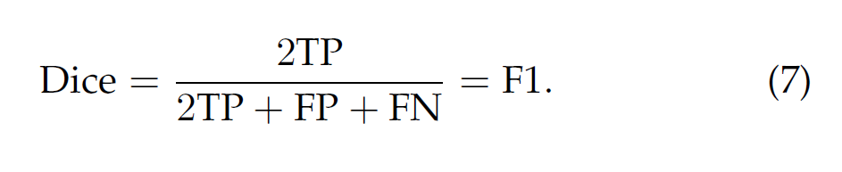

[toc]

# Image Segmentation Using Deep Learning:A Survey 使用深度学习进行图像分割：一项调查

S.Minaee是Snapchat机器学习研究部的，Y. Boykov是滑铁卢大学的，F. Porikli是澳大利亚国立大学的，Huawei. A. Plaza是西班牙埃斯特雷马杜拉大学的，N. Kehtarnavaz是德州大学达拉斯分校的，D. Terzopoulos是加利福尼亚大学洛杉矶分校的。

摘要--图像分割是计算机视觉和图像处理中的一项关键任务，具有场景理解、医学图像分析、机器人感知、视频监控、增强现实和图像压缩等重要应用，文献中出现了许多分割算法。在此背景下，深度学习（DL）的广泛成功促使人们开发出利用DL模型的新图像分割方法。我们对这一最新文献进行了全面的回顾，涵盖了语义和实例分割方面的开创性工作，包括卷积像素标记网络、编码器-解码器架构、多尺度和基于金字塔的方法、递归网络、视觉注意力模型和对抗性环境中的生成模型。我们研究了这些基于DL的分割模型的关系、优势和挑战，检查了广泛使用的数据集，比较了性能，并讨论了有希望的研究方向。

索引词-图像分割，深度学习，卷积神经网络，编码器-解码器模型，递归模型，生成模型，语义分割，实例分割，全景分割，医学图像分割

## 1 引文

自计算机视觉领域早期以来，图像分割一直是该领域的一个基本问题[1]（第八章）。作为许多视觉理解系统的重要组成部分，它涉及到将图像（或视频帧）分割成多个片段和对象[2]（第五章），并在广泛的应用中发挥着核心作用[3]（第六部分），包括医学图像分析（如肿瘤边界提取和组织体积测量）、自主车辆（如可航行表面和行人检测）、视频监控和增强现实等等。

图像分割可以被表述为用语义标签对像素进行分类的问题（语义分割），或对单个物体进行分割（实例分割），或两者都是（全景分割）。语义分割对所有图像像素进行像素级的标记，包括一组物体类别（如人、车、树、天空）；因此，它通常比整个图像分类的要求更高，后者为整个图像预测一个单一的标签。实例分割通过检测和划分图像中每个感兴趣的对象（例如，单个人）来扩展语义分割的范围。

文献中开发了许多图像分割算法，从最早的方法，如阈值化[4]、基于直方图的捆绑、地区增长[5]、K-means聚类[6]、分水岭方法[7]，到更先进的算法，如主动轮廓线[8]、图切割[9]、条件和马尔科夫随机场[10]，以及基于稀疏度的[11]、[12]方法。然而，近年来，深度学习（DL）模型已经产生了一个新的产生的图像分割模型具有显著的性能改进，通常在流行的基准上达到最高的准确率（例如，图1）。这已经引起了该领域的范式转变。

本调查报告是[14]的修订版，涵盖了基于深度学习的图像分割的最新文献，包括迄今为止提出的100多个此类分割方法。它对这些方法的不同方面进行了全面的回顾，包括训练数据、网络结构的选择、损失函数、训练策略以及它们的主要贡献。目标文献被组织成以下几类。

1) Fully convolutional networks
2) Convolutional models with graphical models
3) Encoder-decoder based models
4) Multiscale and pyramid network based models
5) R-CNN based models (for instance segmentation)
6) Dilated convolutional models and DeepLab family
7) Recurrent neural network based models
8) Attention-based models
9) Generative models and adversarial training
10) Convolutional models with active contour models
11) Other models

在这个分类法中。

* 我们对基于深度学习的图像分割算法进行了全面的回顾和分析；
* 我们概述了流行的图像分割数据集，分为二维和2.5维（RGB-D）图像；
* 我们总结了回顾的分割方法在流行基准上的表现；
* 我们讨论了基于深度学习的图像分割的几个挑战和未来研究方向。

本调查的其余部分组织如下：

* 第2节概述了流行的深度神经网络（DNN）架构，它是许多现代分割算法的骨干。
* 第3节回顾了最重要的基于深度学习的分割模型。
* 第4节概述了一些最流行的图像分割数据集和它们的特点。
* 第5节列出了评估基于深度学习的分割模型的流行指标，并将模型的性能列表。
* 第6节讨论了基于深度学习的分割方法的主要挑战和机遇。
* 第7节介绍了我们的结论。

## 2 深度神经网络架构

本节概述了计算机视觉界使用的主要DNN架构，包括卷积神经网络、递归神经网络和长短期记忆、编码器-解码器和自动编码器模型，以及生成式对抗网络。 由于篇幅有限，将不涉及已经提出的其他几种DNN架构，其中包括transformer、胶囊网络、门控递归单元和空间transformer网络。

### 2.1 卷积神经网络（CNN）

CNN是深度学习界最成功和最广泛使用的架构之一，特别是在计算机视觉任务中。CNN最初是由Fukushima[16]在其关于 "Neocognitron "的开创性论文中提出的，该论文是基于Hubel和Wiesel的视觉皮层分层接收场模型。随后，Waibel等人[17]引入了具有时空感受野共享权重的CNN和用于音素识别的反向传播训练，LeCun等人[15]开发了一个用于文档识别的实用CNN架构（图2）。

CNN通常包括三种类型的层：i）卷积层，其中权重的内核（或过滤器）被卷积以提取特征；ii）非线性层，对特征图应用（通常是逐元的）激活函数，从而使网络能够模拟非线性函数；以及iii）池化层，通过用关于这些邻域的一些统计信息（平均值、最大值等）替换特征图中的小邻域来降低空间分辨率。各层的神经元单元是局部连接的；也就是说，每个单元从上一层的单元的一个小的邻域（称为感受野）接受加权输入。通过堆叠各层形成多分辨率金字塔，较高层次的层从越来越广泛的感受野中学习特征。CNN的主要计算优势在于，一个层中的所有感受野共享权重，从而使参数的数量明显少于全连接的神经网络。一些最知名的CNN架构包括AlexNet[18]、VGGNet[19]和ResNet[20]。

### 2.2 循环神经网络(RNNs)和LSTM

图3.一个简单的RNN的结构。由Christopher Olah提供[21]。

RNNs[22]通常用于处理连续数据，如语音、文本、视频和时间序列。参照图3，在每个时间步骤t，模型收集上一步的输入xt和隐藏状态ht1，并输出一个目标值ot和下一个隐藏状态ht+1。 RNNs对于长序列来说通常是有问题的，因为它们不能捕捉许多现实世界应用中的长期依赖关系，并且经常遭受梯度消失或爆炸问题。然而，一种被称为长短时记忆（LSTM）的RNN[23]被设计用来避免这些问题。LSTM结构（图4）包括三个门（输入门、输出门和遗忘门），它们调节信息流入和流出存储单元，存储任意时间间隔的值。

图4.一个标准LSTM模块的结构。由Olah提供[21]。

### 2.3 编码器-解码器 和 自动编码模型 Encoder-Decoder and Auto-Encoder Models

编码器-解码器[24], [25]是一个模型系列，它通过一个两阶段的网络学习将数据点从输入域映射到输出域（图5）。编码器执行一个编码函数z = g(x)，将输入的x压缩成一个潜空间表示，而解码器y = f(z)从z预测输出的y。潜在的，或特征（向量）的表示捕捉了输入的语义信息，对预测输出是有用的。这种模型在自然语言处理（NLP）应用中的序列到序列建模以及图像到图像的翻译中很受欢迎，其中输出可能是图像的增强版本（如图像的去模糊化或超分辨率）或分割图。自动编码器是编码器-解码器模型的一个特例，其中输入和输出是相同的。

图5.一个简单的编码器-解码器模型的结构。

### 2.4 生成对抗网络 Generative Adversarial Networks (GANs)

它们由两个网络组成--生成器和判别器（图6）。在传统的GAN中，生成器网络G学习从噪声z（有一个先验分布）到目标分布y的映射，这与 "真实 "样本相似。判别器网络D试图将生成的 "假 "样本与真实样本区分开来。GAN可以被描述为G和D之间的最小化博弈，其中D试图最小化其在区分虚假样本和真实样本时的分类误差，因此最大化损失函数，而G试图最大化判别器网络的误差，因此最小化损失函数。GAN的变种包括Convolutional-GANs[27]、conditional-GANs[28]和Wasserstein-GANs[29]。

图6.GAN的结构。Ian Goodfellow提供。

## 3 基于深度学习的图像分割模型 DL-BASED IMAGE SEGMENTATION MODELS

本节是对众多基于学习的分割方法的调查，根据其模型结构分为10类。在这些方法中，有几个架构特征是共同的，如编码器和解码器、skip-connections、多尺度架构，以及最近使用的扩张卷积。根据模型对先前模型的架构贡献对模型进行分组是很方便的。

### 3.1 全卷积神经网络 FCN

Long等人[30]提出了全卷积网络（FCN），这是基于DL的图像语义分割模型的一个里程碑（奠基性工作）。一个FCN（图7）只包括卷积层，这使得它能够输出一个与输入图像大小相同的分割图。为了处理任意大小的图像，作者修改了现有的CNN架构，如VGG16和GoogLeNet，删除了所有全连接层，使模型输出的是空间分割图而不是分类分数。

图7.FCN学会了进行像素精确的预测。来自[30]。

通过使用skip-连接（图8），模型最后几层的特征图被放大并与前面几层的特征图融合，该模型结合了语义信息（来自深层、粗层）和外观信息（来自浅层、细层），以产生准确和详细的分割。 在PASCAL VOC、NYUDv2和SIFT Flow上测试，该模型实现了最先进的分割性能。

图8.跳过连接结合了粗略的和精细的信息。来自[30]。

FCN已经被应用于各种分割问题，如脑瘤分割[31]、实例意识语义分割[32]、皮肤病变分割[33]和虹膜分割[34]。虽然证明了DNN可以被训练成以端到端的方式对可变大小的图像进行语义分割，但传统的FCN模型有一些局限性--它对于实时推理来说计算成本太高，**它没有以有效的方式考虑全局上下文信息**，而且它不容易被推广到三维图像。一些研究人员试图克服FCN的一些限制。例如，**Liu等人[32]** 提出了一个名为ParseNet的模型，以解决FCN的一个问题——忽略 全局上下文信息。ParseNet通过使用层的平均特性来增强每个位置的特征，向FCNs添加全局上下文。一个图层的特征映射被合并起来整个图像会产生一个上下文向量。这个上下文向量被规范化并未合并，以产生与初始向量具有相同大小的新特征图。然后将这些特征映射连接起来。简而言之，ParseNet是一个FCN，它用所描述的模块取代了卷积层（图9）。

**全局上下文信息：语义上下文（可能性），空间上下文（位置），尺度上下文（尺寸），上下文就是图片中某个区域与周围区域的关系。**

图9.ParseNet（e）使用额外的全局背景来产生比FCN（c）更平滑的分割（d）。来自[35]。

### 3.2 具有图形模型的卷积模型

如前所述，FCN忽略了潜在的有用的场景级语义上下文。为了集成更多的上下文，一些方法将概率图形模型，如 条件随机场（**CRFs**）和马尔可夫随机场（**MRFs**） ，合并到DL架构中。Chen等人[37 ]提出了一种基于cnn和全连接CRFs组合的语义分割算法（图10）。他们表明，来自深度最后一层的cnn的响应没有足够地定位到精确的目标分割（由于不变性使cnn适合于高级任务，如分类）。为了克服深度CNN的差定位特性，他们将最终CNN层的响应与一个全连接的CRF结合起来。他们表明，他们的模型能够以比以前的方法更高的精度定位段边界。

图10.一个CNN+CRF模型。来自[36]。

Schwing和Urtasun [38]提出了一种全连接的深度结构网络。他们提出了一种联合训练cnn和全连接crf进行语义图像分割的方法，并在具有挑战性的PASCAL VOC 2012数据集上取得了令人鼓舞的结果。在[39]中，Zheng等人提出了一种类似的语义分割方法，将CRF与CNN集成起来。
在另一项相关工作中，Lin等人[40]提出了一种基于上下文深度CRFs的有效语义分割算法。他们探索了“patch-patch”的背景（在图像区域之间）和“补丁-背景”上下文，通过使用上下文信息来改进语义分割。

**Liu等人[41]** 提出了一种语义分割算法，该算法将丰富的信息整合到mrf中，包括高阶关系和标签上下文的混合。与之前使用迭代算法优化mrf的工作不同，他们提出了一个CNN模型，即解析网络，它能够在单次向前传递中实现确定性的端到端计算。

条件随机场CRF：是一种鉴别式机率模型，是随机场的一种，常用于标注或分析序列资料，如自然语言文字或生物序列。马尔可夫随机场MRF：是指下一个时间点的值只与当前值有关系，与以前没有关系，即未来决定于现在而不是过去

### 3.3 基于编码器-解码器的模型

大多数流行的基于DL的分割模型使用某种编码器-解码器结构。我们将这些模型分为两类：用于一般图像分割的模型和用于医学图像分割的模型。

#### 3.3.1 一般图像分割

Noh等人[41]介绍了基于去卷积（又称转置卷积）的语义分割。他们的模型DeConvNet（图11）由两部分组成，一个是采用VGG 16层网络的卷积层的编码器，一个是输入特征向量并生成像素精确类概率图的多层转置卷积网络。后者包括转置卷积层和反池化层，用于识别像素级标签并预测分割掩码。

图11.转置卷积的语义分割。来自[41]。

转置卷积：stride=1，padding=0

转置卷积：

转置卷积不是卷积的逆运算，在深度学习中DeConvolution指的是转置卷积。当填充为p步幅为s时

* 在行和列之间插入s-1行或列
* 将输入填充k-p-1（k是核窗口）也就是正常卷积里面的padding
* 将核矩阵上下、左右翻转
* 然后做正常的卷积
  输入输出尺寸换算：
* 输入高（宽）为n，核为k,填充p,步幅s
* 转置卷积：n’ = sn + k - 2p - s
* 卷积：n’ = （n - k + 2p) / s + 1

反池化层-利用编码器的最大池化层

Badrinarayanan等人[25]提出了SegNet，一个用于图像分割的全卷积编码器-解码器架构（图12）。与转置卷积网络类似，SegNet的核心可训练分割引擎包括一个编码器网络，它在拓扑上与VGG16网络的13个卷积层相同，还有一个相应的解码器网络，之后是一个像素级分类层。SegNet的主要创新之处在于解码器对其低分辨率的输入特征图进行上采样；具体来说，就是利用**相应编码器的最大池化步骤中计算的池化索引**来进行非线性上采样。

图12.SegNet模型。来自[25]。

基于编码器-解码器的模型的一个局限性是，由于编码过程中分辨率的损失，导致了细粒度图像信息的损失。HRNet[42]（图13）解决了这个缺点。除了像DeConvNet、SegNet和其他模型那样恢复高分辨率的表征外，HRNet通过**并行连接高低分辨率的卷积流并重复交换不同分辨率的信息**，在编码过程中保持高分辨率的表征。 有四个阶段：第1阶段由高分辨率的卷积组成，而第2/3/4阶段重复2分辨率/3分辨率/4分辨率块。最近的几个语义分割模型使用HRNet作为骨干。

其他几项工作采用转置卷积，或编码器-解码器进行图像分割，如叠加转置卷积网络（SDN）[43]、Linknet[44]、WNet[45]，以及用于RGB-D分割的位置敏感解卷积网络[46]。

图13.HRNet的结构。来自[42]。

#### 3.3.2 医学和生物医学图像分割

受FCN和编码器-解码器网络启发的几个模型最初被开发用于医疗/生物医学领域的图像分割方面，现在也被用于医学领域之外。

Ronneberger等人[47]提出了U-Net（图14），用于有效分割生物显微镜图像。U-Net的结构包括两部分，一个是捕捉上下文的收缩路径，另一个是实现精确定位的对称扩展路径。U-Net的训练策略依赖于使用数据增强来从极少的注释图像中有效学习。它在30张透射光显微镜图像上进行了训练，并在2015年ISBI细胞追踪挑战赛中以较大优势获胜。

图14.U-Net模型。来自[47]。

针对不同类型的图像和问题领域，U-Net的各种扩展已经被开发出来，例如，Zhou等人[48]开发了一个嵌套的U-Net架构，Zhang等人[49]开发了一个基于U-Net的道路分割算法，Cicek等人[50]提出了一个用于三维图像的U-Net架构。

Milletari等人[51]提出的用于三维医学图像分割的V-Net（图15），是另一个著名的基于FCN的模型。作者引入了一个基于Dice系数的新损失函数，使该模型能够处理前景和背景中的体素数量严重不平衡的情况。 该网络在前列腺的MRI图像上进行了端到端的训练，并学会了一次性预测整个体积的分割情况。其他一些关于医学图像分割的相关工作包括Progressive Dense V-Net等用于胸部CT图像的肺叶自动分割，以及用于病变分割的3D-CNN编码器[52]。

图15.用于三维图像分割的V-Net模型。来自[51]。

### 3.4 基于多尺度和金字塔网络的模型

多尺度分析是图像处理中一个成熟的理念，已被部署在各种神经网络架构中。这方面最突出的模型之一是由Lin等人提出的特征金字塔网络（FPN）[53]，它是为物体检测而开发的，但也被应用于分割。深度CNN固有的多尺度、金字塔式的层次结构被用来构建特征金字塔，其额外成本微乎其微。为了合并低分辨率和高分辨率的特征，FPN由一个自下而上的通路、一个自上而下的通路和横向连接组成。然后，合并的特征图由3×3卷积处理，以产生每个阶段的输出。最后，自上而下通路的每个阶段产生一个预测，以检测一个物体。对于图像分割，作者使用两个多层感知机（MLPs）来生成掩码。

Zhao等人[54]开发了金字塔场景解析网络（PSPN），这是一个多尺度的网络，可以更好地学习场景的全局上下文表征（图16）。使用残差网络（ResNet）作为特征提取器，从输入图像中提取多个图案，并使用扩张网络。 然后，这些特征图被送入金字塔汇集模块，以区分不同尺度的图案。它们被汇集到四个不同的尺度，每个尺度对应一个金字塔级别，并由一个1×1的卷积层处理，以减少它们的尺寸。金字塔层的输出被上采样并与初始特征图相concat，以获取局部和全局信息。 最后，卷积层被用来生成像素级预测。。

图16.PSPN的结构。来自[54]。

Ghiasi和Fowlkes[55]开发了一个基于拉普拉斯金字塔的多分辨率重建架构，该架构使用来自高分辨率特征图的跳过连接和乘法门控来连续细化由低分辨率图重建的片段边界。他们表明，虽然卷积特征图的表面空间分辨率很低，但高维特征表示包含重要的亚像素定位信息。

亚像素点定位（即 **以超过像素精度的精度估计点对象的坐标** ）是一项具有挑战性的任务，其特点是点预测所需的精度与输入图像的粒度之间存在差异。

还有其他使用多尺度分析进行分割的模型，如DM-Net（动态多尺度滤波器网络）[58]、上下文对比网络和门控多尺度聚合（CCN）[59]、自适应金字塔上下文网络（APC-Net）[60]、多尺度上下文交织（MSCI）[61]和显著对象分割[62]。
`多层感知机:其实就是人工神经网络，由输入层-隐层-输出层组成。`
 `mask(掩模、掩码）是深度学习常见操作，简单而言，其相当于在原始张量上盖上一层掩膜，从而屏蔽或选择一些特定元素，因此常用于构建张量的滤波器。`

### 3.5 基于R-CNN的模型

区域CNN（R-CNN）及其扩展已被证明在物体检测应用中是成功的。特别是，Faster R-CNN[61]架构（图17）使用了一个区域提议⽹络（RPN），该网络提出了bounding box的候选者。 RPN提取了一个感兴趣的区域（RoI），一个RoIPool层从这些建议中计算特征，以推断出物体的边界盒坐标和类别。R-CNN的一些扩展被用来解决实例分割问题；即同时进行物体检测和语义分割的任务。

图17.Faster R-CNN结构。每幅图像由卷积层处理并提取其特征，在RPN中对特征图上的每个位置使用滑动窗口，对于每个位置，使用k（k=9）个锚箱（128、256和512三种比例，1：1、1：2、2：1三种长宽比）来生成一个区域建议；一个cls层对k个箱子是否有物体输出2k分；一个reg层对k个箱子的坐标（箱子中心坐标、宽度和高度）输出4k。来自[61]。

何凯明等人[62]提出了Mask R-CNN（图18），它在许多COCO对象实例分割的挑战上表现优于以前的基准（图19），有效地检测了图像中的对象，同时为每个实例生成了高质量的分割掩码。从本质上讲，它是一个具有三个输出分支的Faster-R-CNN：第一个计算边界框坐标，第二个计算相关的类别，第三个计算二进制掩码以分割物体。掩码R-CNN损失函数结合了边界框坐标、预测类别和分割掩码的损失，并对所有这些损失进行联合训练。

图18.掩码R-CNN结构。来自[62]。

由Liu等人[65]提出的路径聚合网络（PANet）是基于Mask R-CNN和FPN模型的（图19）。该网络的特征提取器使用了一种FPN（特征金字塔）架构，它具有一种新的增强的自底而上的路径，改善了底层特征的传播。这第三条路径的每个阶段都将前一阶段的特征图作为输入，并使用3×3卷积层进行处理。使用横向连接将输出添加到自上而下路径的相同阶段特征图中，这些特征图输入下一个阶段。在Mask RCNN中，自适应特征池化层的输出提供了三个分支。前两个使用完全连接的层来生成边界框坐标和相关对象类的预测。第三个方法使用FCN处理RoI来预测对象掩码。

图20.路径聚合网络。(a) FPN骨干网。(b) 自下而上的路径扩增。(c) 自适应特征集合。(d) Box分支。(e) 全连接的融合。来自[63]。

Dai等人[66]开发了一个用于实例感知语义分割的多任务网络，该网络由三个网络组成，分别是区分实例、估计掩码和分类对象。这些网络形成了一个级联结构，并被设计成共享它们的卷积特征。Hu等人[67]提出了一种新的部分监督训练范式，以及一种新的权重传递函数，可以训练实例分割模型，所有类别都有框注释，但只有一小部分有掩码注释。
Chen等人[68]开发了一个实例分割模型MaskLab（图20），基于更快的R-CNN用语义和方向特征细化目标检测。该模型产生了Bbox检测、语义分割和方向预测三个输出。建立在FasterRCNN对象检测器上，预测的盒子提供了对象实例的精确定位。在每个感兴趣的区域内，MaskLab通过结合语义和方向预测来进行前景/背景分割。

Chen等人提出的Tensormask[67]是基于密集滑动窗口实例分割的。作者将密集实例分割视为4D张量上的预测任务，并提出了一个通用框架，使4D张量上的新运算符成为可能。他们证明了张量方法比基准产生了巨大的收益，其结果与Mask R-CNN相当。

其他基于R-CNN的实例分割模型已经被开发出来，比如为mask proposals开发的模型，包括R-FCN[68]、DeepMask[69]、Polar- Mask[70]、边界感知的实例分割[71]和CenterMask[72]。另一种有希望的方法是通过学习分组线索来解决实例分割问题，用于自下而上的分割，如深度分水岭变换[73]、实时实例分割[74]，以及通过深度度量学习进行语义实例分割[75]。

### 3.6 空洞卷积模型

扩张（又称 "atrous"）卷积为卷积层引入了另一个参数，即扩张率。例如，一个扩张率为2的3×3核（图22）将具有与5 5核相同大小的感受野，而只使用9个参数，从而在不增加计算成本的情况下扩大了感受野。

图22.空洞卷积。一个3×3的内核在不同的扩张率下。

空洞卷积在实时分割领域一直很受欢迎，最近的许多出版物都报道了这种技术的使用。其中最重要的一些包括DeepLab系列[76]，多尺度上下文聚合[77]，密集升频卷积和混合空洞卷积（DUC-HDC）[78]，密集连接的Atrous空间金字塔池（DenseASPP）[79]，以及高效网络（ENet）[80]。

Chen等人开发的DeepLabv1[36]和DeepLabv2[76]是最受欢迎的图像分割模型之一。后者有三个主要特点（图23）。首先是使用空洞卷积来解决由最大池化和跨度引起的网络中分辨率下降的问题。第二是空洞金字塔池化Atrous Spatial Pyramid Pooling（ASPP），它用多个采样率的滤波器探测传入的卷积特征层，从而捕获物体以及多尺度的图像背景，在多个尺度上稳健地分割物体。第三是通过结合来自深度CNN的方法，如全卷积的VGG-16或ResNet 101，以及概率图形模型，特别是完全连接的CRF，改进物体边界的定位。

图23. DeepLab的模型。来自[76]。

随后，Chen等人[13]提出了DeepLabv3，它结合了级联和平行模块的扩张卷积。并行卷积模块被分组到ASPP中。在ASPP中加入了1×1卷积和批量归一化。所有的输出都被串联起来，并由另一个1×1卷积处理，以创建每个像素的对数的最终输出。接下来，[81]发布了Deeplabv3+（图24），它使用了一个编码器-解码器架构，包括由深度卷积（输入的每个通道的空间卷积）和点卷积（以深度卷积为输入的1×1卷积）组成的稀释可分离卷积。 他们使用DeepLabv3框架作为编码器。最相关的模型有一个修改过的Xception主干，有更多的层，扩张的深度可分离卷积，而不是最大池化和批量归一化。

图24.DeepLab-v3+模型。来自[81]。

### 3.7 基于RNN的模型

虽然CNN是计算机视觉问题的自然选择，但它们并不是唯一的可能性。RNNs在建模像素之间的短期/长期依赖关系以（潜在地）改善分割图的估计方面很有用。 使用RNNs，像素可以被链接在一起并被连续处理，以建模全局背景并改善语义分割。然而，图像的自然二维结构构成了一个挑战。

Visin等人[82]提出了一个用于语义分割的基于RNN的模型，称为ReSeg（图25）。这个模型主干是基于ReNet[83]，它是为图像分类而开发的。每个ReNet层由四个RNN组成，在水平和垂直两个方向上扫过图像，对斑块/活动进行编码，并提供相关的全局信息。为了用ReSeg模型进行图像分割，ReNet层堆叠在预训练的VGG-16卷积层之上，提取通用的局部特征，然后再由上采样层来恢复最终预测中的原始图像分辨率。

图 25. ReSeg 模型（没有预训练的 VGG-16 特征提取器）。 来自[82]。

Byeon等人[84]使用二维LSTM网络对自然场景的图像进行了每像素分割和分类，该网络在一个单一的模型中学习纹理和标签的复杂空间依赖关系，进行分类、分割和上下文整合。

Liang等人[85]提出了一个基于图-LSTM网络的语义分割模型（图26），其中卷积层被建立在超级像素图上的图-LSTM层所增强，后者提供了一个更全面的结构背景。这些层将统一的、阵列结构的数据的LSTM（即行、网格或对角线LSTM）概括为非统一的、图形结构的数据，其中任意形状的超级像素是语义一致的节点，超级像素之间的相邻关系对应于边，从而形成一个无定向图（图27）。

图27.传统的RNN模型和图-LSTM的比较。 来自[85]。

Xiang和Fox[86]提出了数据关联递归神经网络（DA-RNNs），用于联合三维场景映射和语义标签。DA-RNNs使用一种新的递归神经网络结构对RGB-D视频进行语义标注。 网络的输出与Kinect-Fusion等映射技术相结合，以便将语义信息注入重建的3D场景中。

Hu等人[87]开发了一种语义分割算法，它结合了一个CNN来编码图像和一个LSTM来编码其语言描述。为了从语言输入中产生像素级的图像分割，他们提出了一个端到端的可训练的递归和卷积模型，共同学习处理视觉和语言信息（图28）。这与传统的语义分割不同，它是在一组预定义的语义类别上进行的；例如，"两个人坐在右边的长椅上 "这句话只需要分割右边长椅上的两个人，而不需要分割坐在其他长椅上或站着的人。图29显示了该模型的一个分割结果的例子。

图28.用于自然语言表达的语义分割的CNN+LSTM架构。来自[87]。

图29.为查询 "穿蓝色大衣的人 "而生成的CNN+LSTM分割掩码。来自[87]。

基于RNN的模型的一个缺点是，它们通常会比CNN的模型慢，因为它们的顺序性不适合并行化。

### 3.8 基于注意力机制的模型

多年来，注意力机制一直在计算机视觉中被不断探索，发现将其应用于语义分割的出版物并不令人惊讶。

Chen等人[88]提出了一种注意力机制，该机制可以学习对每个像素位置的多尺度特征进行柔和加权。他们改编了一个强大的语义分割模型，并用多尺度图像和注意力模型对其进行联合训练。在图30中，该模型对背景中的人（绿色虚线圈）的尺度为1.0的特征分配了较大的权重，对大孩子（品红色虚线圈）的尺度为0.5的特征也分配了较大的权重。注意力机制使模型能够评估不同位置和比例的特征的重要性，而且它比平均和最大集合要好。

图30.基于注意力的语义分割模型。来自[88]。

与卷积分类器被训练来学习标记对象的代表性语义特征的方法不同，Huang等人[89]提出了一个用于语义分割的反向注意力网络（RAN）架构（图31），该架构还应用了反向注意力机制，从而训练模型来捕捉相反的概念--与目标类别不相关的特征。RAN网络同时执行直接和反向注意力的学习过程。

图31.基于RAN结构

Li等人[90]开发了一个用于语义分割的金字塔注意力网络，它利用全局上下文信息进行语义分割。舍弃了复杂的扩张卷积和解码器网络，他们将注意力机制和空间金字塔结合起来，为像素标签提取精确的密集特征。Fu等人[91]提出了一个用于场景分割的双注意网络，该网络可以在自我注意机制的基础上捕捉丰富的上下文依赖关系。具体来说，他们在扩张的FCN之上附加了两种注意力模块，分别在空间和通道维度上模拟语义的相互依赖。位置注意模块通过加权和选择性地聚集每个位置的特征。

注意机制在语义分割中的其他应用包括OCNet[92]，它采用了受自我注意机制启发的对象语境池化，ResNeSt：Split-Attention Networks [93], Height-driven Attention Networks [94], Expectation-Maximization Attention (EMANet) [95], Criss-Cross Attention Network (CCNet) [96], end-to-end instance segmentation with recurrent attention [97], a point-wise spatial attention network for scene parsing [98], and Discriminative Feature Network (DFN) [99] 。

### 3.9 生成模型和对抗训练

GANs已被应用于计算机视觉中的广泛任务，不排除图像分割。

Luc等人[100]提出了一种用于语义分割的对抗性训练方法，他们在训练卷积语义分割网络（图32）的同时，还训练了一个对抗性网络，该网络可以区分地面真实的分割图和分割网络生成的分割图。他们表明，对抗性训练方法在斯坦福背景和PASCAL VOC 2012数据集上产生了更好的准确性。

图32.用于语义分割的GAN。来自[100]。

Souly等人[101]提出了使用GANs的半弱监督的语义分割。他们的模型由一个生成器网络组成，为一个多类分类器提供额外的训练实例，在GAN框架中充当判别器，从可能的标签类别中为样本分配一个标签或将其标记为一个假样本（额外类别）。

Hung等人[102]开发了一个使用对抗性网络的半监督性语义分割的框架。考虑到空间分辨率，他们设计了一个FCN判别器来区分预测的概率图和地面真相的分割分布。 这个模型的损失函数有三个项：分割真实值的交叉熵损失，判别器网络的对抗性损失，以及基于判别器的置信图输出的半监督损失。

Xue等人[103]提出了一个具有多尺度L1损失的对抗性网络，用于医学图像分割。他们使用FCN作为分割器来生成分割标签图，并提出了一个具有多尺度L1损失函数的新型对抗性批判网络，以迫使批判器和分割器同时学习捕捉像素间长短距离空间关系的全局和局部特征。

其他基于对抗性训练的方法包括使用GANs进行细胞图像分割[104]，以及物体不可见部分的分割和生成[105]。

### 3.10 带有主动轮廓模型的CNN模型

对FCN和主动轮廓模型（ACM）[8]之间协同作用的探索最近引起了研究兴趣。

一种方法是在ACM原理的启发下制定新的损失函数。例如，受[106]的全局能量表述的启发，Chen等人[107]提出了一个监督损失层，在FCN的训练过程中结合了预测掩模的面积和大小信息，并解决了心脏MRI中的心室分割问题。同样，Gur等人[108]提出了一个基于无边缘的形态学主动轮廓[109]的无监督损失函数，用于微血管图像分割。

一种不同的方法最初试图将ACM仅仅作为FCN输出的后处理程序来使用，并且有几项工作试图通过预训练FCN来进行适度的共同学习。Le等人[110]的工作是自然图像语义分割任务的ACM后处理器的一个例子，其中水平集ACM被实现为RNN。Rupprecht等人的Deep Active Contours[111]，是另一个例子。对于医学图像分割，Hatamizadeh等人[112]提出了一个综合的深度主动病变分割（DALS）模型，该模型训练FCN骨干来预测一个新的、局部参数化的水平集能量函数的参数函数。在另一项相关工作中，Marcos等人[113]提出了深度结构化主动轮廓（DSAC），它在一个结构化预测框架中结合了ACM和预训练的FCN，用于在航空图像中建立实例分割（尽管需要手动初始化）。

Cheng等人[114]提出了深层主动射线网络（DarNet），它与DSAC类似，但采用了不同的基于极坐标的显式ACM表述，以防止轮廓的自我交叉。

Hatamizadeh等人[115]最近推出了一个真正的端到端可训练的、完全集成的FCN-ACM组合，被称为可训练的深度主动轮廓（TDAC）。在[112]的基础上，他们以骨干FCN层之后的额外卷积层的形式实现了局部参数化的水平集ACM，利用Tensorflow的自动区分机制，在整个DCAC框架中反向传播训练误差梯度。这个完全自动化的模型在训练和分割过程中都不需要干预，可以自然地分割感兴趣的物体的多个实例，并处理任意的物体形状，包括尖角，FoveaNet[126]（透视感知场景解析），Ladder DenseNet[127]，Bilateral Segmentation Network（BiSeNet）[128]，Semantic Prediction Guidance for Scene Parsing（SPGNet）[129]，门控形状CNN[130]，Adaptive Context Network（AC-Net）[131]，Dynamic-Structured Semantic Propagation Network（DSSPN）[132]， Symbolic Graph Reasoning（SGR）[133]，CascadeNet[134] 。Scale-Adaptive Convolutions (SAC) [135], Unified Perceptual Parsing Network (UperNet) [136], segmentation by re-training and self-training [137], densely connected neural architecture search [138], hierarchical multiscale attention [139], Efficient RGB-D Semantic Segmentation (ESA-Net) [140], Iterative Pyramid Contextts [141], and Learning Dynamic Routing for Semantic Segmentation [142]。

泛光分割[143]越来越受欢迎。 这方面的努力包括泛光特征金字塔网络（PFPN）[144]，泛光分割的注意力引导网络[145]，无缝场景分割[146]，泛光Deeplab[147]，统一的泛光分割网络[148]，以及高效泛光分割[149]。

图33提供了2014年以来一些最具代表性的DL图像分割模型的时间轴。

### 3.11 Other Models

其他流行的用于图像分割的DL架构包括如下：

上下文编码网络（EncNet）[116]使用一个基本的特征提取器，并将特征图送入一个上下文编码模块。RefineNet[117]是一个多路径细化网络，明确利用沿下采样过程中的所有信息，利用长距离的剩余连接实现高分辨率的预测。Seednet[118]引入了一种带有深度强化学习的自动种子生成技术，通过学习来解决交互式分割问题。对象-上下文表示法（OCR）[42]学习对象区域以及每个像素和每个对象区域之间的关系，用对象-上下文表示法增强表示像素。其他的模型和方法包括BoxSup [119], Graph Convolutional Networks (GCN) [120], Wide ResNet [121], Exfuse [122] (增强低级和高级特征融合), Feedforward-Net [123], 地理视频分割的saliency-aware模型 [124], Dual Image Segmentation (DIS) [125] 。

图33.基于DL的代表性图像分割算法的时间轴。粉色、绿色和黄色块分别表示语义、实例和全景分割算法。

## 4 数据集

在本节中，我们调查了最常用于训练和测试DL图像分割模型的图像数据集，将它们分为3类--2D（像素）图像、2.5D RGB-D（颜色+深度）图像和3D（体素）图像，并提供关于每个数据集特征的细节。

数据增强经常被用来增加标记样本的数量，特别是对于小数据集，如医学成像领域的数据集，从而提高DL分割模型的性能。在数据空间或特征空间，或两者（即图像和分割图）中应用一组变换。典型的变换包括平移、反射、旋转、扭曲、缩放、色彩空间移动、裁剪和对主成分的投影。数据增强也可以通过产生更快的收敛性、减少过度拟合的机会和增强概括性而获益。对于一些小的数据集，数据增强已被证明可以将模型性能提高20%以上。

### 4.1 2D 图像数据集

大部分的图像分割研究都集中在二维图像上；因此，有许多二维图像分割数据集可用。以下是一些最受欢迎的。

**PASCAL Visual Object Classes (VOC)** [150]是计算机视觉领域一个非常流行的数据集，其注释的图像可用于5个任务--分类、分割、检测、动作识别和人物布局。对于分割任务，有21个标记的物体类别，如果像素不属于这些类别中的任何一个，则被标记为背景。 该数据集分为训练和验证两组，分别有**1,464和1,449幅图像**，还有一个用于实际挑战的私人测试集。图34显示了一个示例图像及其像素级的标签。

图34.来自PASCAL VOC数据集的一个示例图像。来自[151]。

**PASCAL Context**[152]是PASCAL VOC 2010检测挑战的延伸。它包括所有训练图像的像素级标签。它包含了400多个类别（包括原始的20个类别和来自PASCAL VOC分割的背景），分为三个类别（物体、东西和混合体）。这个数据集的许多物体类别过于稀疏，因此，通常选择59个类别的子集来使用。

**Microsoft Common Objects in Context (MS COCO)** [153] 是一个大规模的物体检测、分割和说明数据集。COCO包括复杂的日常场景的图片，包含了自然环境下的常见物体。这个数据集包含了91种物体类型的照片，在328K的图像中共有250万个标记实例。 图35将MS-COCO的标签与以前的数据集的标签进行了比较，以获得一个样本图像。

图35.一个样本图像和COCO的分割图。来自[153]。

**Cityscapes**[154]是一个大型数据库，重点是对城市街道场景的语义理解。它包含了50个城市的街道场景中录制的不同的立体视频序列，其中有5K帧的高质量的像素级注释，此外还有一组20K的弱注释帧。它包括30个类别的语义和密集的像素注释，分为8个类别--道路、人类、车辆、建筑、物体、自然、天空和空白。图36显示了这个数据集的分割图样本。

图36.Cityscape数据集的分割图。来自于[154]

ADE20K /MIT场景解析（SceneParse150）为场景解析算法提供了一个训练和评估平台。 该基准的数据来自ADE20K数据集[134]，其中包含超过20K以场景为中心的图像，详尽地注释了物体和物体部分。 该基准分为20K图像用于训练，2K图像用于验证，以及另一批图像用于测试。 该数据集中有150种语义类别。

SiftFlow[155]包括2,688张有注释的图片，来自LabelMe数据库的一个子集，包括8个不同的户外场景，其中有街道、山脉、田野、海滩和建筑，并且属于33个语义类别之一。

斯坦福背景[156]包括来自现有数据集的室外场景图像，如LabelMe、MSRC和PASCAL VOC。它包括715张至少有一个前景物体的图像。该数据集是按像素注释的，并且可用于语义场景理解。

伯克利分割数据集（BSD）[157]包含对30名人类受试者的1000张Corel数据集图像的12000个手工标记的分割。它的目的是为图像分割和边界检测的研究提供一个经验基础。一半的分割是通过向受试者展示彩色图像获得的，另一半是通过展示灰度图像获得的。基于此数据的公共基准由300张图像的所有灰度和彩色分割组成。这些图像被分为由200张图像组成的训练集和由100张图像组成的测试集。

Youtube-Objects[158]包含从YouTube上收集的视频，其中包括10个PASCAL VOC类别的物体（飞机、鸟、船、汽车、猫、牛、狗、马、摩托车和火车）。原始数据集不包含像素级的注释（因为它最初是为物体检测而开发的，注释很弱）。然而，Jain等人[159]手动注释了126个序列的子集，然后提取了一个帧子集来进一步生成语义标签。在这个数据集中，总共有大约10,167个有注释的480x360像素的帧可用。

CamVid：是另一个场景理解数据库（重点是道路/驾驶场景），它最初是通过安装在汽车仪表板上的摄像机拍摄的五个视频序列。通过从序列中取样，总共提供了701个框架。这些帧被人工注释为32个类别。

KITTI[160]是最受欢迎的自动驾驶数据集之一，包含了用各种传感器模式（包括高分辨率RGB、灰度立体相机和三维激光扫描仪）录制的交通场景视频。原始数据集不包含用于语义分割的地面真实，但研究人员对数据集的部分内容进行了人工注释；例如，Alvarez等人[161]为道路检测挑战中的323幅图像生成了地面真实，有3个类别--道路、垂直和天空。

其他用于图像分割的数据集包括语义边界数据集（SBD）[162]、PASCAL部分[163]、SYNTHIA[164]和Adobe的人像分割[165]。

### 4.2 2.5D Datasets

随着可负担得起的范围扫描仪的出现，RGB-D图像已经变得越来越广泛。以下的RGB-D数据集是最受欢迎的。

NYU-Depth V2[166]包括由微软Kinect的RGB和深度摄像头记录的各种室内场景的视频序列。它包括1,449个密集标记的RGB和深度图像对，这些图像来自3个城市的450多个场景。每个物体都被贴上了类别和实例编号（如cup1、cup2、cup3，等等）。它还包含407,024个未标记的帧。图37显示了一个RGB-D样本和它的标签图。

图37.纽约大学V2数据集的一个样本。从左边开始。RGB图像，预处理的深度图像，类别标签图。来自[166]。

SUN-3D[167]是一个大型的RGB-D视频数据集，包含了从41个不同建筑的254个不同空间拍摄的415个序列；有8个序列被注释了，未来还会有更多的序列被注释。每个被注释的帧都提供了场景中物体的语义分割，以及关于摄像机姿势的信息。

SUN RGB-D[168]提供了一个RGB-D基准，用于推进所有主要场景理解任务的最先进水平。它由四个不同的传感器捕获，包含10,000幅RGB-D图像，其规模与PASCAL VOC相似。

ScanNet[169]是一个RGB-D视频数据集，包含1500多个扫描中的250万个视图，用3D相机姿势、表面重建和实例级语义分割进行注释。为了收集这些数据，我们设计了一个易于使用和可扩展的RGB-D捕捉系统，其中包括自动的表面重建，而语义注释是由群众提供的。使用这些数据有助于在几个三维场景理解任务上达到最先进的性能，包括三维物体分类、语义体素标签和CAD模型检索。

斯坦福2D-3D[170]提供了各种相互注册的2D、2.5D和3D模式，并带有实例级的语义和几何注释，从6个室内区域获取。它包含70,000多张RGB图像，以及相应的深度、表面法线、语义注释，还有全局XYZ图像、相机信息，以及注册的原始和语义注释的3D网格和点云。

另一个流行的2.5D数据集是UW RGB-D物体数据集[171]，它包含了使用Kinect式传感器记录的300个常见家庭物体。

## 5 DL分割模型的性能

在这一节中，我们总结了常用于评估分割模型性能的指标，并报告了基于DL的分割模型在基准数据集上的性能。

### 5.1 图像分割模型的衡量标准

理想情况下，一个图像分割模型应该在多个方面进行评估，如：

* 定量精度
* 视觉质量
* 速度（推理时间）
* 存储要求（内存占用）

然而，到目前为止，大多数研究人员都集中在量化模型准确性的指标上。以下指标是最受欢迎的：

**像素精度**是正确分类的像素除以总像素数的比率。对于K+1类（K个前景类和背景），像素准确度定义为：

其中pij是预测属于i类的像素数，属于j类。

预测正确数/预测总数

**平均像素准确度（MPA）**是PA的延伸，其中正确像素的比率是以每一类的方式计算的，然后在总类数上取平均值。

**联合体上的交集（IoU）**，或Jaccard指数，被定义为预测的分割图A和地面真实图B之间的交集面积，除以两个地图之间的联合体面积，范围在0和1之间。

Mean-IoU被定义为所有类别的平均IoU。

Precision / Recall / F1

精度/召回率/F1分数可以为每个类定义，也可以在总体水平上定义，如下所示。

其中TP指的是真阳性的部分，FP指的是假阳性的部分，FN指的是假阴性的部分。通常，人们对精确率和召回率的综合版本感兴趣；F1得分被定义为精确率和召回率的谐波平均值。

骰子系数，常用于医学图像分析，可以定义为预测图和地面真实图的重叠面积的两倍除以总像素数。

它与IoU（3）非常相似，当应用于二元地图时，以前景为正类，Dice系数与F1得分（7）相同。

### 5.2 基于DL的模型的定量性能

在这一节中，我们将前面讨论的几种算法在流行的分割基准上的表现制成表格。尽管大多数出版物都报告了模型在标准数据集上的表现，并使用了标准指标，但其中一些出版物没有这样做，因此很难进行全面的比较。此外，只有少数出版物以可重复的方式提供额外的信息，如**执行时间和内存足迹**，这对工业应用（如无人机、自动驾驶汽车、机器人等）很重要，这些应用可能在计算能力和存储空间有限的嵌入式系统上运行，**因此需要轻量级的模型**。

下表总结了几个著名的基于DL的分割模型在不同数据集上的表现。

表1着重介绍了PASCAL VOC测试集。显然，自从引入第一个基于DL的图像分割模型--FCN以来，这些模型的准确性有了很大的提高。

表1 在PASCAL VOC测试集上的分割模型的准确度

在其他数据集（MS-COCO、ImageNet等）上预先训练的模型。

表2着重介绍了Cityscape测试数据集。在这个数据集上，最新的模型比开创性的FCN模型有大约23%的相对增益。

表3着重介绍了MS COCO东西测试集。这个数据集比PASCAL VOC和Cityescapes更具挑战性，因为最高的mIoU约为40%。

表4着重介绍了ADE20k验证集的情况。这个数据集也比PASCAL VOC和Cityescapes数据集更具挑战性。

表5提供了突出的实例分割算法在COCO test-dev 2017数据集上的性能，在平均精度方面，以及它们的速度。实例分割模型在COCO test-dev 2017上的表现

表6提供了在MS-COCO val数据集上著名的全景分割算法在全景质量方面的表现[143]。

最后，表7总结了几个著名的模型在NYUD-v2和SUN-RGBD数据集上进行RGB-D分割的性能。

## 6 挑战和机遇

毫无疑问，图像分割已经从深度学习中获益良多，但还有几个挑战摆在面前。接下来我们将讨论一些有希望的研究方向，我们相信这些方向将有助于进一步推进图像分割算法。

### 6.1 更多具有挑战性的数据集

一些大规模的图像数据集已经被创建用于语义分割和实例分割。然而，仍然需要更具挑战性的数据集，以及不同种类的图像数据集。对于静态图像来说，具有大量物体和重叠物体的数据集将是非常有价值的。这可以使模型的训练能够更好地处理密集的物体场景，以及现实世界中常见的物体之间的大量重叠。随着三维图像分割的不断普及，特别是在医学图像分析中，对大规模注释的三维图像数据集也有强烈的需求，这比低维的对应数据集更难创建。

### 6.2 结合DL和早期的分割模型

现在人们普遍认为，基于DL的分割算法的性能正在趋于稳定，特别是在某些应用领域，如医学图像分析。**为了将性能提升到下一个层次，我们必须进一步探索基于CNN的图像分割模型与突出的 "经典 "基于模型的图像分割方法的结合。CNN与图形模型的整合已经被研究过了，但它们与主动轮廓线、图切割和其他分割模型的整合是相当新的，值得进一步研究。**

### 6.3 可解释的深度模型

 虽然基于DL的模型在具有挑战性的基准上取得了可喜的表现，但关于这些模型仍有一些开放的问题。例如，深度模型到底在学习什么？我们应该如何解释这些模型学到的特征？在给定的数据集上能达到一定分割精度的最小神经结构是什么？虽然有一些技术可用于可视化这些模型的学习卷积核，但对这些模型的基本行为/动态的全面研究还缺乏。对这些模型的理论方面有更好的理解，就能开发出更好的模型，以适应各种分割场景的需要。

### 6.4 弱监督和无监督学习

 弱监督（又称少量拍摄）学习[186]和无监督学习[187]正成为非常活跃的研究领域。这些技术有望对图像分割特别有价值，因为在许多应用领域，收集像素准确标记的训练图像是有问题的，在医学图像分析中尤其如此。转移学习的方法是在一大组标记的样本（可能来自公共基准）上训练一个通用的图像分割模型，然后在一些特定目标应用的样本上对该模型进行微调。自监督学习是另一个很有前途的方向，在各个领域都吸引了很多人。在自我监督学习的帮助下，图像中的许多细节可以被捕获，以便用更少的训练样本来训练分割模型。基于强化学习的模型也可能是另一个潜在的未来方向，因为它们在图像分割中几乎没有受到关注。 例如，MOREL[188]介绍了一种用于视频中移动物体分割的深度强化学习方法。

### 6.5 各种应用的实时模型

 在许多应用中，准确性是最重要的因素；然而，在有些应用中，拥有能够近乎实时地运行的分割模型，或者以普通相机的帧率（至少每秒25帧）运行也是至关重要的。这对于例如部署在自动驾驶汽车中的计算机视觉系统是很有用的。目前的大多数模型离这个帧率还很远；例如，FCN-8处理一个低分辨率的图像大约需要100ms。基于**空洞卷积**的模型在一定程度上有助于提高分割模型的速度，但仍有很大的改进空间。

### 6.6 内存效率模型

许多现代分割模型即使在推理阶段也需要大量的内存。到目前为止，很多努力都是为了提高这类模型的准确性，但是为了使它们适用于特定的设备，如移动电话，网络必须被简化。这可以通过使用更简单的模型，或者使用模型压缩技术，甚至通过训练一个复杂的模型并使用知识蒸馏技术将其压缩成一个更小的、内存效率高的网络来实现，以模仿复杂模型。

### 6.7 应用

基于DL的分割方法已成功应用于遥感领域的卫星图像[189]，如支持城市规划[190]和精准农业[191]。 由机载平台[192]和无人机[193]收集的图像也已使用基于DL的分割方法进行分割，以解决重要的环境问题，包括与气候变化相关的问题。遥感领域的主要挑战来自于图像的巨大尺寸（通常由具有数百甚至数千个光谱带的成像光谱仪收集）以及评估分割算法准确性所需的有限的地面真实信息。同样，基于DL的分割技术在建筑材料的评估中[194]也面临着相关图像数据量大和用于验证的参考信息有限的挑战。 最后但同样重要的是，基于DL的分割的一个重要应用领域是生物医学成像[195]。在这里，一个机会是设计标准化的图像数据库，对评估新的传染病和跟踪大流行病很有用[196]。

## 7 结论

我们已经调查了基于深度学习模型的图像分割算法，这些算法在各种图像分割任务和基准中都取得了令人印象深刻的性能，这些算法被归类为架构类别，如：CNN和FCN、RNN、R-CNN、空洞CNN、基于注意力的模型、生成和对抗性模型等等。我们总结了这些模型在一些流行基准上的量化表现，如PASCAL VOC、MS COCO、Cityscapes和ADE20k数据集。最后，我们讨论了未来几年基于深度学习的图像分割的一些开放性挑战和有希望的研究方向。
